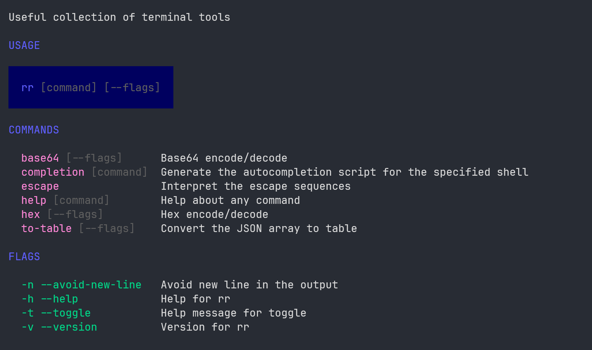

# rr

rr is a collection of helpful terminal utilities.

Motivation is to make a swiss army knife of all the nice tools you would need in terminal with very easy syntax for primary usecases.



# Utilities in rr  

- **escape** (interpret the escape sequences)
- **to-table** (converts the JSON array to a table)
- **hex** (encode/decode hex)
- **base64** (encode/decode base64)

# Prerequisites  

Golang should be installed.

# Installation 

```go
go install github.com/meetwithabhishek/rr@latest
```

To install the fancy CLI app with more vibrant theme but a little sluggish experience, run: 

```go
go install -tags=fang github.com/meetwithabhishek/rr@latest
```